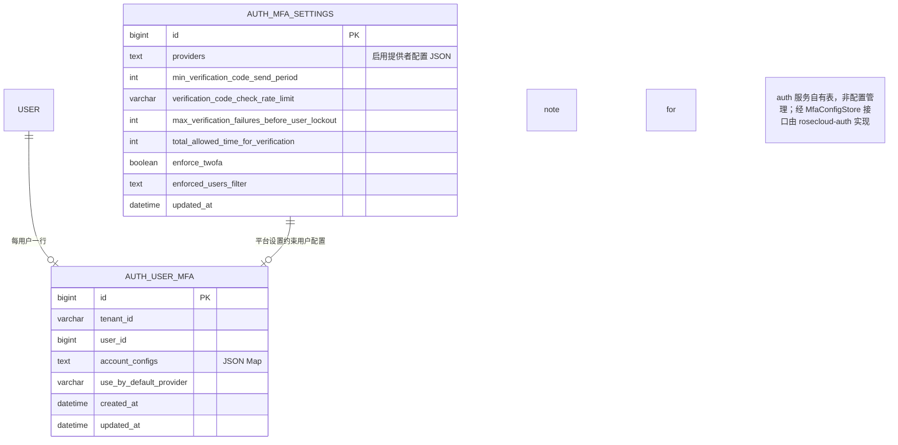
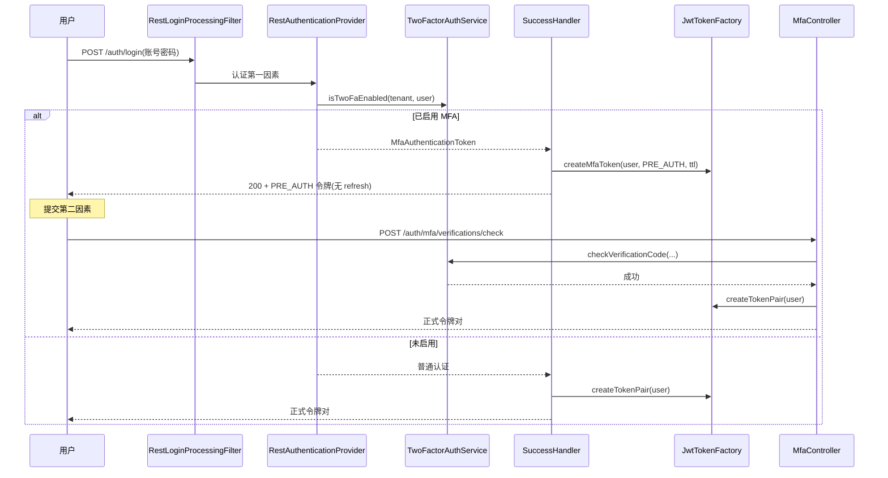

# RoseCloud 多因素验证（MFA）设计方案

> 版本 v1.0（首版以 TOTP + 恢复码为既定第二因素，受租户套餐能力门控）。
> 借鉴基准：ThingsBoard `~/github/thingsboard` 提交 `9a4f1c5` 的 MFA 实现（详见 `docs/adr/thingsboard-reference.md` A3 / A5.2 / A6.2）。
> 本文描述认证增强子域设计；MFA 逻辑内置 `rosecloud-starter-security`（库，不依赖任何微服务），持久化由 `rosecloud-auth` 服务承载（starter 仅定义存储接口）。

## 0. 定位与边界

- MFA 是**账号密码第一因素通过后的第二因素校验**，不替代第一因素（PRD §5.1、约束 §5.1-225）。
- 首版第二因素：**TOTP + 恢复码（BACKUP_CODE）**。短信/邮件 OTP 为后续增强，且**复用通知中心 `/notices/send` 事务性发送**（PRD §5.1-125、§5.7）。
- 强制 MFA（`enforceTwoFa`）、记住设备（remember device）为再后续增强，本文仅预留边界。
- MFA 的校验、待验证凭证、恢复码管理**收口在认证与授权模块**，与正式访问态、会话治理边界一致（PRD §5.1-230）。不存在 notice → system 调用。
- MFA 开启受**租户套餐可选能力门控**：未授权该能力的租户下用户不得启用 MFA（PRD §5.1-134）。

## 1. 架构总览

```
              rosecloud-starter-security（已有，MFA 内置其中）
   ┌──────────────────────────────────────────────────────────────┐
   │  登录主链路                                        MFA 子域      │
   │  RestLoginProcessingFilter → RestAuthenticationProvider        │
   │  JwtTokenFactory / JwtAuthenticationProvider / SessionStore     │
   │  BruteForceProtection (Redis 登录级限频/锁定)                   │
   │  ─────────────── 同一模块内 ───────────────                    │
   │  MfaAuthenticationToken / MfaConfigurationToken                │
   │  TwoFactorAuthService ── TwoFaConfigManager                     │
   │  TwoFactorAuthProvider SPI ◀── TOTP / BACKUP_CODE /(OTP)        │
   │  MfaController（verifications/configs/settings/providers）      │
   └──────────────────────────────────────────────────────────────┘
```
（经 `rosecloud.mfa.enabled` 开关激活 MFA 分支与提供者；关闭时登录走原路径，无 MFA 逻辑介入。）

- MFA 逻辑**内置于 `rosecloud-starter-security`**（不另建 starter 模块）；随 `rosecloud.mfa.enabled` 默认关闭，开启后登录成功处理器在同一模块内直接接入 `TwoFactorAuthService` 完成第二因素分支。
- **持久化归属（关键边界）**：`rosecloud-starter-security` 是 starter（库），不依赖任何微服务模块、不做 DB 访问。MFA 存储定义为接口 `MfaConfigStore`（starter 内声明），由 **`rosecloud-auth` 服务实现**并落到 auth 自有表（`auth_user_mfa` / `auth_mfa_settings`）。starter 经接口使用存储，不耦合 `rosecloud-system` 的配置管理服务——避免 auth→system 的依赖倒置。
- 令牌签发沿用 `JwtTokenFactory`；本文为其扩展 `PRE_AUTH` / `MFA_CONFIGURATION` 作用域（见 §3）。
- 短信/邮件 OTP 发送走通知中心 `/notices/send`（事务性、脱敏、不进站内信），security 模块不直接持有短信/邮件通道（见 §5.3）。

## 2. 领域模型总览

### 2.1 实体清单

| 实体 | 类别 | 说明 |
|---|---|---|
| `UserMfaConfig` | 配置 | **auth 服务自有表** `auth_user_mfa`（每用户一行，JSON，加密落库）；按 `userId` 隔离。值即 `Map<providerType, accountConfig>`；TOTP 密钥加密存、BACKUP_CODE 仅存哈希 |
| `MfaPlatformSettings` | 配置 | **auth 服务自有表** `auth_mfa_settings`；平台级、无租户维度。字段：启用提供者、限频/锁定参数、`totalAllowedTimeForVerification`、`enforceTwoFa`(后续)、`enforcedUsersFilter`(后续) |
| `MfaVerificationCode` | 临时 | OTP 类验证码（SMS/EMAIL）：6 位数字，**仅存 Redis**（带 lifetime），不落库 |
| `PreAuthToken` | 临时 | 密码通过后签发的待验证令牌（`PRE_AUTH` 作用域，短 TTL，无 refresh）；`MFA_CONFIGURATION` 为其变体（强制先配置） |

> `Recipient`/`SecurityUser` 已在 `rosecloud-starter-security`；MFA 不引入新用户实体。

### 2.2 实体关系图



### 2.3 核心说明

- 一份 `UserMfaConfig` 对应一个用户，存于 **auth 服务自有表 `auth_user_mfa`**（非配置管理的 `sys_user_setting`）；值为 `Map<providerType, accountConfig>` JSON（可插拔、可多个），与 ThingsBoard `AccountTwoFaSettings`（`LinkedHashMap<providerType, config>`）一致；`TwoFaConfigManager` 经 starter 内声明的 `MfaConfigStore` 接口读写，由 `rosecloud-auth` 实现。
- `accountConfig` 中 **TOTP 的 `otpauth` URL 含 Base32 密钥**——整条 `account_configs` 值**加密落库**（应用层信封加密/KMS），明文不出域；**BACKUP_CODE 仅存哈希**，明文仅在生成时一次性展示。因值含密钥，`auth_user_mfa` 该列须走加密存储。
- 平台 MFA 设置存于 **auth 服务自有表 `auth_mfa_settings`**（非 `sys_system_setting`），由 `rosecloud-auth` 实现 `MfaConfigStore` 落库；租户是否可用 MFA 由**租户套餐能力**门控（PRD §5.1-134），不在 MFA 设置内做租户覆盖。对齐 ThingsBoard 将 `PlatformTwoFaSettings` 存于 `AdminSettings`，但本仓库把该存储收口在 auth 服务，避免 starter 依赖微服务。
- 该边界的通用约定见 `docs/design/auth-system-boundary.md`：auth 与 system 互不编译依赖、认证域数据由 auth 自持、配置 KV 归 system 且仅通用。

## 3. 领域一：令牌与登录第二因素流程

### 3.1 需求

- 密码通过后，若该用户已启用 MFA，系统不发放正式访问凭证，改发**待验证令牌**（`PRE_AUTH`），提示需要第二因素（PRD §5.1-141）。
- `PRE_AUTH` 令牌：短期有效（默认 30 分钟，取自 `totalAllowedTimeForVerification`，PRD §5.1-227）、单作用、无 refresh、不得用于正式业务访问。
- 强制 MFA 场景（后续增强）：未配置却被强制的用户，发 `MFA_CONFIGURATION` 作用域令牌，必须先完成配置再换正式令牌。
- 第二因素校验通过 → 换发正式访问令牌对（绑定活动租户，与普通登录一致，PRD §5.1-143）。

### 3.2 令牌作用域扩展

在 `rosecloud-starter-security` 的令牌模型中新增 `TokenScope`（对齐 ThingsBoard `Authority` 的 `PRE_VERIFICATION_TOKEN` / `MFA_CONFIGURATION_TOKEN`）：

| 作用域 | 含义 | refresh | TTL |
|---|---|---|---|
| `ACCESS` | 正式访问 | 有 | 正常 |
| `PRE_AUTH` | 待验证（密码已过、待第二因素） | 无 | `totalAllowedTimeForVerification`（默认 1800s） |
| `MFA_CONFIGURATION` | 强制先配置 MFA | 无 | 同上 |

`JwtTokenFactory` 新增 `createMfaToken(SecurityUser, TokenScope, ttl)`：签单 scope 令牌、不带 refresh。`JwtAuthenticationProvider` 解析时**拒绝 `PRE_AUTH`/`MFA_CONFIGURATION` 当作 `ACCESS` 使用**（对齐 ThingsBoard `parseAccessJwtToken` 拒绝 MFA scope）。

### 3.3 接口

**登录主链路（沿用 `/auth/login`，MFA 为内部分支，无新端点）**

**MFA 第二因素端点（`ServiceMetadata.API_PREFIX + "/auth/mfa"`，PRE_AUTH 守卫）**

| 方法 | 路径 | 守卫 | 说明 |
|---|---|---|---|
| POST | `/auth/mfa/verifications?providerType=` | `PRE_AUTH` | 申请发送/准备第二因素验证码（TOTP 无需发送；SMS/EMAIL 经 notice `/notices/send`） |
| POST | `/auth/mfa/verifications/check?providerType=&code=` | `PRE_AUTH` | 校验第二因素；通过则换发正式令牌对 |
| GET | `/auth/mfa/providers` | `PRE_AUTH` | 当前用户可用提供者列表（脱敏联系方式） |
| POST | `/auth/mfa/configuration` | `MFA_CONFIGURATION` | 强制场景（阶段 3）：完成配置后换发正式令牌对 |

### 3.4 实现方式（登录流程）



- 密码通过后按 `isTwoFaEnabled` / `isEnforceTwoFaEnabled` 决定返回 `MfaAuthenticationToken` / `MfaConfigurationToken` / 普通认证（对齐 ThingsBoard `RestAuthenticationProvider` :28、`RestAwareAuthenticationSuccessHandler` :54-57）。
- `PRE_AUTH` 令牌 TTL 取自 `MfaPlatformSettings.totalAllowedTimeForVerification`，缺省回退 30 分钟（对齐 ThingsBoard `RestAwareAuthenticationSuccessHandler.createMfaTokenPair` :72-75）。

## 4. 领域二：MFA 绑定与账户配置

### 4.1 需求

- 已登录用户在安全设置发起绑定；系统先校验**租户套餐已开放 MFA 能力**（PRD §5.1-149）。
- 绑定 TOTP：生成密钥 + 二维码 → 用户扫码录入 → 输入一次有效验证码 → 校验通过后保存（PRD §5.1-150/152）。
- 生成并**一次性展示**恢复码，用户妥善保存；使用后即失效（PRD §5.1-151/131）。
- 关闭 MFA：解除绑定并停用第二因素（PRD §5.1-206）。
- 多提供者：用户可配置一个或多个第二因素提供者（PRD §5.1-129）。

### 4.2 接口（`ServiceMetadata.API_PREFIX + "/auth/mfa/configs"`，需已登录本人，ACCESS 守卫）

| 方法 | 路径 | 说明 |
|---|---|---|
| GET | `/auth/mfa/configs` | 当前用户 MFA 配置概览 |
| POST | `/auth/mfa/configs/{providerType}` | 生成新账户配置（TOTP 返回密钥+二维码 URL；BACKUP 返回明文码一次性） |
| PUT | `/auth/mfa/configs/{providerType}` | 提交验证码校验并保存（生成→校验通过→持久化） |
| PATCH | `/auth/mfa/configs/{providerType}` | 更新（如 useByDefault） |
| DELETE | `/auth/mfa/configs/{providerType}` | 解除该提供者绑定 |

### 4.3 实现方式

- 绑定流程先 `generateNewAccountConfig`（不落库或落库为待确认态）→ 用户提交验证码 → `checkVerificationCode` 通过 → `saveTwoFaAccountConfig` 正式持久化（`POST /auth/mfa/configs/{providerType}` 生成 与 `PUT /auth/mfa/configs/{providerType}` 校验保存 分离，对齐 ThingsBoard `generate/submit/verifyAndSave`）。
- **密钥/码安全**：TOTP 的 `otpauth` URL（含密钥）加密后随整条 `account_configs` 值存入 `auth_user_mfa`（加密落库）；BACKUP_CODE 明文仅经响应一次性返回，落库仅存哈希。
- 套餐门控：所有写操作前调用套餐能力校验，未授权则拒绝（PRD §5.1-134/207）。

## 5. 领域三：验证提供者（SPI）

### 5.1 SPI 设计（对齐 ThingsBoard `TwoFaProvider`）

```java
public interface TwoFactorAuthProvider<C extends TwoFactorAuthProviderConfig,
                                       A extends TwoFactorAuthAccountConfig> {
    A generateNewAccountConfig(SecurityUser user, C providerConfig);
    default void prepareVerificationCode(SecurityUser user, C providerConfig, A accountConfig) {}
    boolean checkVerificationCode(SecurityUser user, String code, C providerConfig, A accountConfig);
    default void check(String tenantId) {}
    TwoFactorAuthProviderType getType();
}
```

- 收集方式：`EnumMap<TwoFactorAuthProviderType, TwoFactorAuthProvider>` 由 Spring 自动注入（`@Autowired setProviders(Collection<...>)`），新增提供者零改动主流程（对齐 ThingsBoard `DefaultTwoFactorAuthService` :57/:188）。
- 类型枚举：`TOTP` / `BACKUP_CODE` / `SMS` / `EMAIL`（后两者阶段 2）。

### 5.2 TOTP 提供者（对齐 ThingsBoard `TotpTwoFaProvider`）

- 密钥：`Base32.encode(secureRandom(20 字节))`（160 bit，兼容标准 TOTP 验证器）。
- 二维码：`otpauth://totp/<issuer>:<email>?secret=<base32>&issuer=<issuer>`，前端据此生成 QR。
- 校验：`new Totp(secret).verify(code)`（aerogear-otp，含时钟漂移窗口）。
- 密钥从 `accountConfig.authUrl` 的 `secret` 参数还原；`authUrl` 加密落库。

### 5.3 OTP 类提供者（SMS / EMAIL，阶段 2，对齐 ThingsBoard `OtpBasedTwoFaProvider`）

- 验证码：`StringUtils.randomNumeric(6)`，存 **Redis**（`verificationCodesCache`，key=`userId`，带 `verificationCodeLifetime` TTL），不落库。
- 发送：调用通知中心 `POST /notices/send`（指定 `SMS`/`EMAIL` 渠道、同步、脱敏），不进「我的通知」（PRD §5.1-125、§5.7）。
- 校验：比对 Redis 中验证码 + `accountConfig` 一致性；超时则失效。

### 5.4 恢复码（BACKUP_CODE，对齐 ThingsBoard `BackupCodeTwoFaProvider`）

- 生成：`random(8, "0-9a-f")` 取 N 个（默认 10）去重 hex 码；落库仅存**哈希**（bcrypt/SHA-256）。
- 校验：命中即从集合中移除该码并持久化（消耗式、使用即失效）；明文仅在生成时返回一次。

## 6. 领域四：平台/租户设置

### 6.1 需求

- 平台级 MFA 设置（启用提供者、限频/锁定参数、验证总时限、强制 MFA 后续），由 **auth 服务自有表 `auth_mfa_settings`** 持久化（经 `MfaConfigStore` 由 `rosecloud-auth` 实现），不复用配置管理 `sys_system_setting`。
- 租户是否可启用 MFA 由**租户套餐能力**门控，不在本设置内做租户覆盖（PRD 仅要求套餐级开关，未要求租户级 MFA 设置覆盖）。

### 6.2 接口（`ServiceMetadata.API_PREFIX + "/auth/mfa/settings"`，需管理员，底层由 `rosecloud-auth` 经 `MfaConfigStore` 实现落到 `auth_mfa_settings`）

| 方法 | 路径 | 说明 |
|---|---|---|
| GET | `/auth/mfa/settings` | 平台级 MFA 设置（JSON） |
| PUT | `/auth/mfa/settings` | 保存平台级 MFA 设置（写入走 `SystemSetting`，带审计） |
| GET | `/auth/mfa/settings/providers` | 可用提供者类型 |

### 6.3 设置模型（对齐 ThingsBoard `PlatformTwoFaSettings`）

| 字段 | 说明 |
|---|---|
| `providers` | 启用的 `TwoFactorAuthProviderConfig` 列表 |
| `minVerificationCodeSendPeriod` | 发送最小间隔（秒），用于 SEND 限频 |
| `verificationCodeCheckRateLimit` | 校验限频（如 `"1:60"` 表示 60s 1 次） |
| `maxVerificationFailuresBeforeUserLockout` | 连续校验失败达此数则锁定用户 |
| `totalAllowedTimeForVerification` | `PRE_AUTH` 令牌 TTL（默认 1800s） |
| `enforceTwoFa` / `enforcedUsersFilter` | 强制 MFA（后续增强） |

## 7. 领域五：限频与锁定

- **SEND 限频**：`minVerificationCodeSendPeriod` 约束验证码下发频率（SMS/EMAIL，阶段 2）。
- **CHECK 限频**：`verificationCodeCheckRateLimit` 约束校验频率。
- **失败锁定**：连续失败达 `maxVerificationFailuresBeforeUserLockout` → 锁定该用户 MFA 验证；成功后清理限频计数（对齐 ThingsBoard `validateTwoFaVerification` + `cleanUpRateLimits`）。
- **复用现有基础设施**：限频/锁定计数复用 Redis，模式对齐 `rosecloud-starter-security` 的 `BruteForceProtection`（按 `userId+providerType` 维度），不新造轮子。
- 限频/锁定仅在 `checkLimits=true` 时生效（绑定校验、登录校验路径）。

## 8. 可靠性与安全性非功能性要求

| 要求 | 落点 | 说明 |
|---|---|---|
| 待验证凭证边界 | §3 | `PRE_AUTH`/`MFA_CONFIGURATION` 短 TTL、无 refresh、被 `JwtAuthenticationProvider` 拒绝当 ACCESS 用 |
| TOTP 密钥加密 | §4.3 | `auth_user_mfa.account_configs` 整条值加密落库，明文不出域 |
| 恢复码仅存哈希 | §5.4 | 明文一次性返回，落库仅哈希 |
| OTP 不落库 | §5.3 | 验证码仅存 Redis（TTL），经 notice 发送且脱敏 |
| 租户套餐门控 | §4.3 / §0 | 未授权能力不得启用/绑定 MFA |
| 限频/锁定 | §7 | 复用 Redis，防爆破 |
| 审计留痕 | （安全与审计） | 绑定/解绑/登录第二因素成功失败记入审计 |

## 9. 分阶段实现

| 阶段 | 范围 |
|---|---|
| 阶段 1（首版） | `rosecloud-starter-security` 内置 MFA 逻辑（`TokenScope.PRE_AUTH` + TOTP/BACKUP_CODE 提供者 + 登录第二因素分支 + 绑定/配置接口）+ `rosecloud-auth` 实现 `MfaConfigStore` 落到 `auth_user_mfa`（加密）/`auth_mfa_settings` + 限频锁定 + 套餐门控 |
| 阶段 2 | SMS/EMAIL OTP 提供者，复用通知中心 `/notices/send`（脱敏、不进站内信） |
| 阶段 3（后续） | `enforceTwoFa` + `enforcedUsersFilter` 强制 MFA、记住设备、OAuth2 登录接入 MFA 分支 |

每个阶段独立可验证；阶段 1 是 MFA 能力的地基。

## 10. 参考（ThingsBoard 源码，提交 9a4f1c5）

| 主题 | ThingsBoard 文件 | 本文落点 |
|---|---|---|
| 提供者 SPI | `service/security/auth/mfa/provider/TwoFaProvider.java` :26-38 | §5.1 |
| 编排/限频/锁定 | `service/security/auth/mfa/DefaultTwoFactorAuthService.java` :90-161 | §3.4 / §7 |
| TOTP | `provider/impl/TotpTwoFaProvider.java` :40-66 | §5.2 |
| 恢复码 | `provider/impl/BackupCodeTwoFaProvider.java` :44-66 | §5.4 |
| OTP 缓存 | `provider/impl/OtpBasedTwoFaProvider.java` :42-67 | §5.3 |
| 配置管理 | `config/TwoFaConfigManager.java` :28-45 | §2.3 / §6 |
| 平台设置 | `common/data/security/model/mfa/PlatformTwoFaSettings.java` :41-55 | §6.3 |
| 待验证令牌签发 | `auth/rest/RestAwareAuthenticationSuccessHandler.java` :54-80 | §3.2 / §3.4 |
| 第二因素端点 | `controller/TwoFactorAuthController.java` :74-153 | §3.3 |
| 落地建议 | `docs/adr/thingsboard-reference.md` A3 / A5.2 / A6.2 | 全文 |

> 路径相对于 `~/github/thingsboard/application/src/main/java/org/thingsboard/server/`；RoseCloud 仅借鉴其可插拔提供者 SPI、pre-auth 令牌流程、限频锁定与消耗式恢复码，并按自身 starter/多租户/通知中心架构裁剪。
