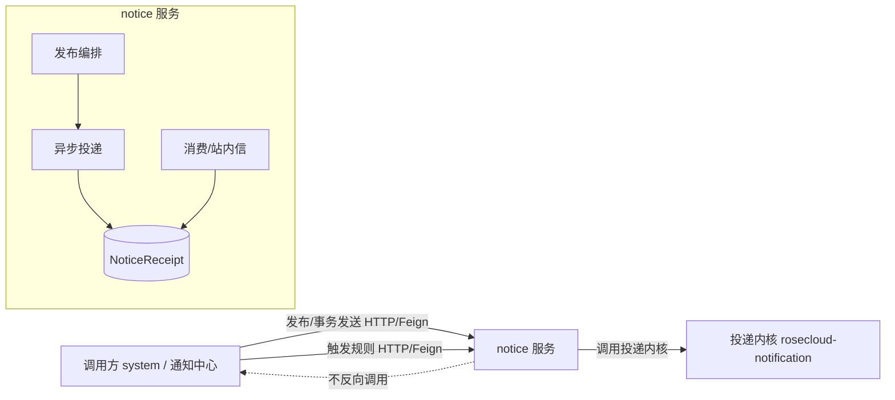
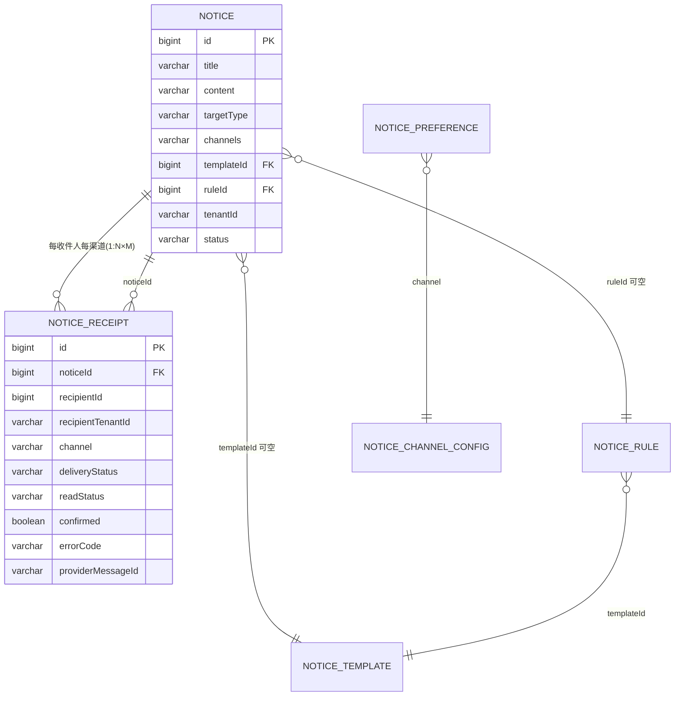
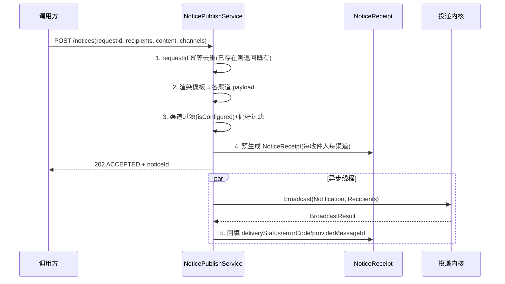
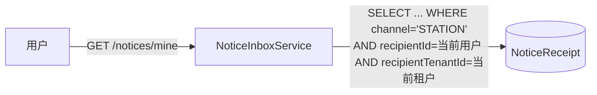

# RoseCloud 通知服务设计方案

> 版本 v2.1（按领域模型重构；借鉴 ThingsBoard 的通知分层与多提供商渠道）。本文描述 `rosecloud-service/rosecloud-notice` 业务层设计；进程内投递内核见 [`notification-engine.md`](notification-engine.md)。

## 0. 定位与边界

通知能力分两层，职责严格分离：

| 层 | 载体 | 职责 | 不负责 |
|---|---|---|---|
| 投递内核 | `rosecloud-notification`（SDK，纯 JDK） | 把一条通知按固定策略投递给若干收件人和渠道，在有限超时内重试，输出结构化 `BroadcastResult` | 持久化、收件人解析、模板、规则、偏好、崩溃恢复 |
| 通知服务 | `rosecloud-notice`（Spring） | 发布编排、模板、规则、偏好、消费、持久化、渠道实现 | 收件人解析、用户/角色数据 |

**两条硬边界**：

- 所有"框架能力"（模板/规则/偏好）在服务层，内核保持最小。
- **notice 不依赖 system**：notice 不持有用户/角色数据，不调用 system。收件人解析是**调用方职责**；notice 只接收已解析的 `Recipient` 列表。集成方向单向：`system -> notice`。

## 1. 架构总览



- 集成方向单向：`system -> notice`（发布 `/notices`、事务发送 `/notices/send`、触发 `/notices/rules/{id}/trigger`）。notice 永不回拨 system。
- payload 传输层无关：首版 HTTP（OpenFeign），将来切 MQ 时消息体与当前请求体一致，只换传输层。
- 触发 best-effort：调用方主流程不因通知失败而回滚。

## 2. 领域模型总览

服务包含两类实体：**核心投递实体**（每次发布产生）与**配置实体**（运营维护）。

### 2.1 实体清单

| 实体 | 类别 | 说明 |
|---|---|---|
| `Notice` | 核心 | 通知主体：内容/目标范围(元数据)/渠道集合/templateId/ruleId/发布者/状态 |
| `NoticeReceipt` | 核心 | 每条投递结果：每收件人每渠道一行；`channel=STATION` 即站内信，其余为渠道回执 |
| `NoticeTemplate` | 配置 | 模板：各渠道 `{title,content}`、变量、启用 |
| `NoticeRule` | 配置 | 规则：triggerType → templateId + channels |
| `NoticePreference` | 配置 | 用户偏好：`userId`+`tenantId`+`notificationType`+`channel` 开关 |
| `NoticeChannelConfig` | 配置 | 渠道/提供商配置：按 `(tenantId, channelType)` 唯一，含加密的 `providerConfig` |

`Recipient` **不是**持久化实体——它是发布请求里的临时入参（调用方解析后传入），用于生成 `NoticeReceipt`，不落库。

### 2.2 实体关系图



### 2.3 核心说明

- 一份 `Notice` 声明多个渠道（§3），发布时按"声明渠道 ∩ 已配置 ∩ 用户偏好"展开为 N×M 条 `NoticeReceipt`。
- `NoticeReceipt` 用 `channel` 区分语义：`STATION` 行是用户可读的**站内信**（带 `readStatus`/`confirmed`）；`PUSH`/`EMAIL`/`SMS`/`WEBHOOK` 行是**渠道回执**（带 `deliveryStatus`/`errorCode`/`providerMessageId`），不进"我的通知"。
- `NoticeReceipt` 与 `Notice` 分表：基数（1 对 N×M）与查询模式（按收件人/渠道检索、对账、统计）要求独立可索引的表。
- 所有推式渠道（EMAIL/SMS/PUSH/WEBHOOK）的回执均"先 `PENDING`、异步投递后回填"；仅 `STATION` 站内信"写即达、同步 `SUCCESS`"。

## 3. 领域一：通知发布

### 3.1 需求

- 接收调用方传入的**已解析收件人**与通知内容（或模板+变量），按声明渠道编排投递。
- 一次发布产出可追踪的站内信与各渠道回执。
- 支持定时发布（`SCHEDULED`）。
- 接口必须**幂等**（超时/重试不重复发）。
- 发布请求**异步化**：接入即返回，不在 HTTP 线程内等外部投递。
- 支持**事务性同步发送**（如 MFA/OTP 指定渠道），调用方同步拿到投递结果。

### 3.2 接口

**REST（notice 侧，前缀 `ServiceMetadata.API_PREFIX + "/notices"`）**

| 方法 | 路径 | 说明 |
|---|---|---|
| POST | `/notices` | 发布通知（立即/定时）；`recipients` 由调用方解析后传入；入参含 `requestId` |
| POST | `/notices/preview` | 发布预览：渲染各渠道内容 + 预估收件人数 |
| POST | `/notices/send` | 事务性/OTP 发送：调用方指定渠道（EMAIL/SMS 等），同步返回 `BroadcastResult`；默认 `suppressInbox` + `desensitize` 脱敏存储 |

> **`/notices` vs `/notices/send`**：
> - `/notices`：运营/业务类通知，异步信封（202），可带站内信（默认渠道含 STATION），内容明文持久化。
> - `/notices/send`：事务性发送（MFA/OTP 等），**调用方指定单一渠道**、同步投递、直接返回结果；强制 `suppressInbox`（不生成站内信），且 `desensitize` 脱敏存储内容（见 §9）。

**Feign 契约（`rosecloud-api`，供 system 调用）**

- `NoticePublishApi`：定义 `publish(...)` / `send(...)`；`NoticePublishFeignApi` 加 `@FeignClient(name="rosecloud-notice", ...)` 实现。
- 单体形态走本地 bean（同接口），微服务形态走 Feign，将来切 MQ 复用同一 payload。

**入参（传输层无关）**

```json
{
  "requestId": "uuid-...",
  "title": "...", "content": "...",
  "templateId": null, "variables": {},
  "targetType": "USER",
  "channels": ["STATION", "EMAIL"],
  "publishType": "IMMEDIATE",
  "recipients": [
    { "recipientId": 1, "tenantId": "t1",
      "channels": { "EMAIL": { "address": "a@b.com" } }, "context": {} }
  ]
}
```

**`/notices/send` 示例（MFA 指定 SMS）**

```json
POST /notices/send
{
  "requestId": "mfa-...",
  "title": "登录验证码",
  "content": "您的验证码是 123456",
  "channels": ["SMS"],
  "recipients": [{ "recipientId": 1, "tenantId": "t1",
                   "channels": { "SMS": { "address": "138xxxx" } } }]
}
```

### 3.3 实现方式

发布编排 `NoticePublishService`：



1. **幂等键**：以 `requestId` 去重，已存在同 `requestId` 的 `Notice` 直接返回既有结果，不重复预生成、不重复投递（防 system 重试重复发 SMS 烧钱）。
2. **异步信封**：HTTP 线程只做"接收入库 + 返回 `202`"，内核 `broadcast` 在异步线程执行（§3.4）。
3. **预生成即站内信**：`channel=STATION` 的 `NoticeReceipt` 在步骤 4 写入即 `deliveryStatus=SUCCESS`，即用户可读的站内信；推式渠道先 `PENDING`，异步回填。
4. **定时发布**：`status=DRAFT` 入库，`@Scheduled` 扫描到期记录触发上述流程。
5. **事务性 `/notices/send`**：不走异步信封，直接在当前线程调内核投递并同步返回 `BroadcastResult`；强制 `suppressInbox`（跳过 STATION 预生成）、`desensitize` 对 `content` 掩码后落库。

### 3.4 异步投递与渠道实现

投递是发布编排的**一步**（步骤 5 调内核 `broadcast`），无独立对外接口；内核 `NotificationEngine.broadcast` 见 `notification-engine.md`。

**服务层渠道实现**

| 渠道 | 类型 | 说明 |
|---|---|---|
| 站内 `STATION` | 拉取式 | 不调内核 `send`，记录预生成即达；其 `NoticeReceipt` 是消息本身 |
| 邮件 `EMAIL` | 推式 | `JavaMailSender`；subject + body 来自模板渲染 |
| 短信 `SMS` | 推式 | `SmsSender`（按租户配置解析提供商） |
| 推送 `PUSH` | 推式 | 推到设备（锁屏提醒），非站内信 |
| 后续 `WEBHOOK`/`DINGTALK_BOT` | 推式 | 按需扩展；webhook 按下游 HTTP 状态码回填回执 |

> **站内 vs PUSH（明确边界）**：站内信落收件箱、持久可读；PUSH 推到设备（锁屏提醒）、瞬时、不进站内中心。一条通知可同时走二者，产生两条不同 `NoticeReceipt`，PUSH 不会"推送站内信"。

**实现要点**

- **内核统一编排**：推式渠道走 `NotificationEngine.broadcast`，内核返回 `BroadcastResult`（Success/Failed/Timeout/Rejected/Skipped），`NoticePublishService` 回填对应 `NoticeReceipt`。
- **站内特例**：`STATION` 不进 `broadcast`，由 `NoticePublishService` 在预生成阶段直接置成功（写入=投递）。
- **提供商多态**：`SmsSenderFactory.create(providerConfig)` 按 `providerType` 分发；渠道实现只依赖 `SmsSender`，不感知厂商。
- **租户感知**：每次 `send` 从 `Recipient.context.tenantId` 解析对应 `SmsSender`，内核透传 `context`。
- **回执状态更新**：EMAIL/SMS/PUSH/WEBHOOK 回执从 `PENDING` 异步更新为 `SUCCESS`/`FAILED`/`TIMEOUT`（webhook 以下游 `2xx` 为成功）；STATION 同步 `SUCCESS`。

**对账扫描**（异步投递的兜底）：

```mermaid
flowchart TD
    A[@Scheduled 定时] --> B{扫描 NoticeReceipt<br/>PENDING/TIMEOUT 且超时}
    B -->|超过最大重试| C[置 FAILED + 进 DLQ/告警]
    B -->|未超限| D[重新入队投递]
```

## 4. 领域二：站内信与消费

### 4.1 需求

- 用户查看"我的通知"、未读数、已读/全部已读、确认、删除。
- 仅展示**站内信**（`channel=STATION`），不含邮件/短信/PUSH/WEBHOOK 回执。
- 严格租户 + 用户隔离，跨租户不可读他人通知。

### 4.2 接口

| 方法 | 路径 | 说明 |
|---|---|---|
| GET | `/notices/mine` | 我的通知（分页 + `unreadOnly`） |
| GET | `/notices/mine/unread-count` | 未读数 |
| POST | `/notices/mine/{id}/read` | 已读 |
| POST | `/notices/mine/read-all` | 全部已读 |
| POST | `/notices/mine/{id}/confirm` | 确认（`needConfirm=true`） |
| DELETE | `/notices/mine/{id}` | 删除 |

> 路径中的 `/notices/mine/{id}` 实际指向 `channel=STATION` 的 `NoticeReceipt` 行（即站内信）。

### 4.3 实现方式

- **`/mine` 与 `unread-count` 仅查 `channel=STATION`** 的 `NoticeReceipt`，天然排除渠道回执。
- **查询层强制隔离**：SQL 层固定 `recipientTenantId = 当前租户 AND recipientId = 当前用户`（来自 `SecurityContext`），即使调用方伪造 ID 也只读自己的记录。
- **已读/确认**只作用于 `STATION` 行的 `readStatus`/`confirmed`；推式渠道的回执无此语义。



## 5. 领域三：模板

### 5.1 需求

- 模板按渠道配置 `title`/`content` 子配置（`STATION` 用 title+content，`EMAIL` 用 subject+body，`SMS` 用 body）。
- 支持变量 `{{var}}`；发布时传入变量值渲染。
- 平台级（`tenantId=null`）与租户级模板。

### 5.2 接口

| 方法 | 路径 | 说明 |
|---|---|---|
| CRUD | `/notices/templates` | 模板管理 |
| POST | `/notices/preview` | 渲染预览（§3.2） |

### 5.3 实现方式

- `NoticeTemplateService.render(template, variables) -> Map<ChannelType, payload>`。
- **渲染安全**：变量注入后，站内 HTML 与邮件 HTML body 必须做 XSS/注入消毒（站内用白名单 sanitizer）；`href` 谨慎处理。
- 模板与规则 `tenantId` 约定：`null` 平台级，非 `null` 租户级。

## 6. 领域四：规则自动化

### 6.1 需求

- 规则 `triggerType -> templateId + channels`；收到触发调用后匹配启用规则并投递。
- 目标收件人由**触发调用方**随请求传入（notice 不解析）。
- 触发器类型：`TENANT_PROVISIONED`、`USER_ACTIVATED`、`USER_PASSWORD_CHANGED` 等。

### 6.2 接口

| 方法 | 路径 | 说明 |
|---|---|---|
| CRUD | `/notices/rules` | 规则管理 |
| POST | `/notices/rules/{id}/trigger` | 触发规则（system 调用；recipients 随请求传入） |

### 6.3 实现方式

- `NoticeRuleService`：收到 trigger → 匹配启用规则 → 用调用方传入 recipients + 规则 template/channels → 走 `NoticePublishService`（§3）。
- 升级 escalation 留后续版本。

## 7. 领域五：用户偏好

### 7.1 需求

- 用户按 `notificationType × channel` 开关通知。
- 偏好数据 notice 自有，不依赖 system。
- 投递前按偏好过滤；平台/租户强制通知可配置是否受偏好约束。

### 7.2 接口

| 方法 | 路径 | 说明 |
|---|---|---|
| GET / PUT | `/notices/preferences` | 用户偏好 |

### 7.3 实现方式

- `NoticePreferenceService`：偏好模型 `NotificationType × Channel` 开关。
- 投递前 `NoticePublishService` 调用偏好过滤：用户关闭的渠道记 `SkippedResult` 对应记录状态，不实际投递。

## 8. 领域六：渠道配置

### 8.1 需求

- 租户级渠道配置，平台级兜底（`tenantId=null`）。
- 多提供商多态（SMS：阿里云/腾讯/华为/SMTP；EMAIL：SMTP/API）。
- 敏感凭证不可明文落库；配置热更新；按租户限流/配额。

### 8.2 接口

| 方法 | 路径 | 说明 |
|---|---|---|
| GET | `/notices/channels` | 当前租户可用渠道（`isConfigured`） |
| CRUD | `/notices/channel-configs` | 渠道配置管理 |
| POST | `/notices/channel-configs/{id}/test` | 测试渠道配置 |

### 8.3 实现方式

- **配置分层**：由 `NoticeChannelConfigService` 按 `(tenantId, channelType)` 唯一管理；解析顺序「租户级 → 平台级默认」。
- **凭证加密（安全硬要求）**：`providerConfig` 敏感字段（SMTP 密码、SMS `accessKeySecret`、API Key）写入时加密（应用层信封加密或密钥管理），读取时解密仅注入 `SmsSender`/`MailSender`，查询接口脱敏。
- **配置缓存**：以 `(tenantId, channelType)` 为键缓存 `NoticeChannelConfig`（Caffeine，短 TTL），变更同步失效，避免热路径打库。
- **租户限流/配额**：投递前按租户速率限制 + 周期额度（尤其 SMS 成本）；超限记跳过/限流并触发平台预警。
- **平台默认播种**：notice 启动时由 DB 迁移/`ApplicationRunner` 种入平台级默认配置——`STATION` 始终启用（无需 providerConfig），邮件/短信置 `enabled=false` 占位，管理员补全后启用。阶段 1 落地即可发站内信。

## 9. 可靠性与安全性非功能性要求

跨领域，上线前必补：

| 要求 | 落点 | 说明 |
|---|---|---|
| 幂等 | §3.3 | `requestId` 去重，防重复投递 |
| 异步信封 | §3.3 | 接收入库即返回，内核投递在异步线程 |
| 对账扫描 | §3.4 | PENDING/TIMEOUT 超时重投或置 FAILED |
| 事务发件箱 | §10 | system 侧 outbox，notice 宕机不丢关键通知 |
| 凭证加密 | §8.3 | `providerConfig` 敏感字段加密落库 |
| 敏感内容脱敏存储 | §3.2 / §3.3 | OTP/敏感通知（`/notices/send`）内容掩码落库，不存明文；收件人地址可脱敏 |
| 租户隔离 | §4.3 | `/mine` 查询层强制 `recipientTenantId`+`recipientId` |
| 渲染消毒 | §5.3 | 站内/邮件 HTML 防 XSS |
| 限流/配额 | §8.3 | 按租户限速，尤其 SMS |
| 失败处置 DLQ | §3.4 | 重试耗尽进告警/队列，不静默丢弃 |

## 10. 与其他服务集成（单向 system -> notice）

```mermaid
flowchart LR
    subgraph system
        ev[业务事件: 租户开通/用户激活] --> ob[(事务发件箱)]
        ob -->|HTTP/Feign 或 MQ| pub[notice /notices /notices/send /notices/rules/{id}/trigger]
    end
    pub --> notice[notice 服务]
```

- `rosecloud-api` 定义 `NoticePublishApi`、`NoticeTriggerApi`；微服务形态由 `NoticePublishFeignApi`/`NoticeTriggerFeignApi` 加 `@FeignClient` 实现，单体形态走本地 bean。
- payload 传输层无关：将来切 MQ 时消费者复用同一 payload。
- **事务发件箱**：通知为 best-effort，但关键通知（租户开通/用户激活）应在 system 侧落 outbox，保证 notice 不可用时不丢失（至少一次投递）。
- MFA/OTP 等事务性发送走 `/notices/send`（指定渠道、同步、脱敏），不进站内信收件箱。
- 触发时机：租户开通完成 → `TENANT_PROVISIONED`；用户激活完成 → `USER_ACTIVATED`。触发失败不影响主流程。
- **不存在 notice -> system 调用**：收件人解析一律在调用方完成。

## 11. 分阶段实现

| 阶段 | 范围 |
|---|---|
| 阶段 1 基础闭环 | 发布编排（异步+幂等+对账）+ `/notices/send` 事务性发送 + 消费（租户隔离）+ `Notice`/`NoticeReceipt` 两表 + 站内/邮件渠道 + 平台级渠道配置（含默认播种）+ DB 迁移 |
| 阶段 2 模板中心 | `NoticeTemplate` + 渲染 + 发布接入模板 + 发布预览 |
| 阶段 3 规则自动化 | `NoticeRule` + trigger 接收口 + system 接入 |
| 阶段 4 偏好与多渠道 | `NoticePreference` + 短信/Push/Webhook/钉钉 + 租户级渠道配置（多提供商）+ 限流配额 + 请求统计 |

每个阶段独立可验证；阶段 1 是后续地基。
